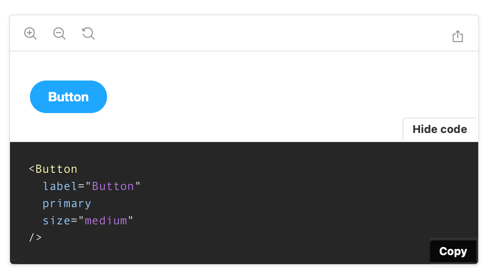
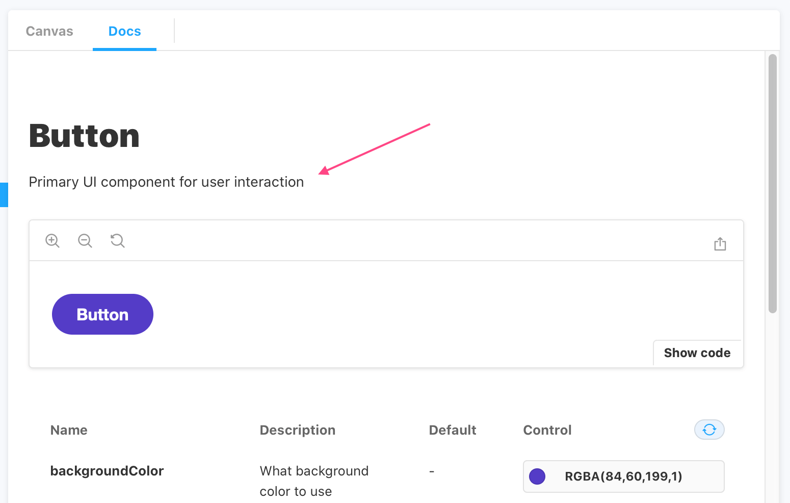
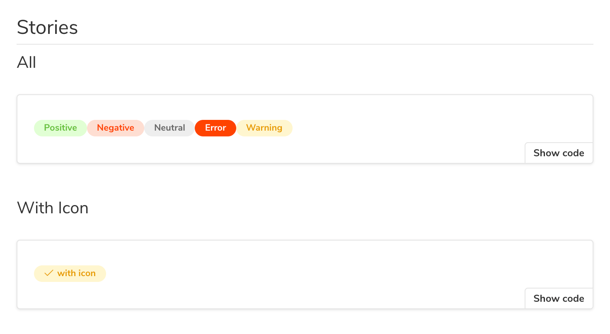

Doc Blocks are the building blocks of Storybook documentation pages. By default, [DocsPage](./docs-page.md) uses a combination of the blocks below to build a page for each of your components automatically.

Custom [addons](../configure/user-interface.md#storybook-addons) can also provide their own doc blocks.

## ArgsTable

Storybook Docs automatically generates component args tables for components in supported frameworks. These tables list the arguments ([args for short](../writing-stories/args.md)) of the component, and even integrate with [controls](../essentials/controls.md) to allow you to change the args of the currently rendered story.

<video autoPlay muted playsInline loop>
  <source
    src="addon-controls-docs-optimized.mp4"
    type="video/mp4"
  />
</video>

This is extremely useful, but it can be further expanded. Additional information can be added to the component to better document it:

<!-- prettier-ignore-start -->

<CodeSnippets
  paths={[
    'react/button-component-with-proptypes.js.mdx',
    'react/button-component-with-proptypes.ts.mdx',
    'angular/button-component-with-proptypes.ts.mdx'
  ]}
/>

<!-- prettier-ignore-end -->

By including the additional information, the args table will be updated. Offering a richer experience for any stakeholders involved.

### DocsPage

To use the `ArgsTable` in [DocsPage](./docs-page.md#component-parameter), export a component property on your stories metadata:

<!-- prettier-ignore-start -->

<CodeSnippets
  paths={[
    'common/my-component-story.js.mdx',
  ]}
/>

<!-- prettier-ignore-end -->

### MDX

To use the `ArgsTable` block in MDX, add the following:

<!-- prettier-ignore-start -->

<CodeSnippets
  paths={[
    'common/component-story-mdx-argstable-block.mdx.mdx',
  ]}
/>

<!-- prettier-ignore-end -->

### Customizing

`ArgsTables` are automatically inferred from your components and stories, but sometimes it's useful to customize the results.

`ArgsTables` are rendered from an internal data structure called [ArgTypes](../api/argtypes.md). When you declare a story's component metadata, Docs automatically extracts ArgTypes based on the component's properties.

You can customize what's shown in the `ArgsTable` by customizing the `ArgTypes` data. This is currently available for [DocsPage](./docs-page.md) and `<ArgsTable story="xxx">` construct, but not for the `<ArgsTable of={component} />` construct.

NOTE: This API is experimental and may change outside of the typical semver release cycle

The API documentation of `ArgTypes` is detailed in a [separate section](../api/mdx.md#argtypes), but to control the description and default values, use the following fields:

| Field                          |                                           Description                                            |
| :----------------------------- | :----------------------------------------------------------------------------------------------: |
| **name**                       |                                     The name of the property                                     |
| **type.required**              |                         The stories to be show, ordered by supplied name                         |
| **description**                |                             A Markdown description for the property                              |
| **table.type.summary**         |                                   A short version of the type                                    |
| **table.type.detail**          |                                   A short version of the type                                    |
| **table.defaultValue.summary** |                                   A short version of the type                                    |
| **table.defaultValue.detail**  |                                   A short version of the type                                    |
| **control**                    | See [addon-controls README ](https://github.com/storybookjs/storybook/tree/next/addons/controls) |

For instance:

<!-- prettier-ignore-start -->

<CodeSnippets
  paths={[
    'common/component-story-csf-argstable-customization.js.mdx',
  ]}
/>

<!-- prettier-ignore-end -->

This would render a row with a modified description, a type display with a dropdown that shows the detail, and no control.

If you find yourself writing the same definition over and over again, Storybook provides some convenient shorthands, that help you streamline your work.

For instance you can use:

- `number`, which is shorthand for `type: {name: 'number'}`
- `radio`, which is a shorhand for `control: {type: 'radio' }`

#### MDX

To customize `argTypes` in MDX, you can set an `mdx` prop on the `Meta` or `Story` components:

<!-- prettier-ignore-start -->

<CodeSnippets
  paths={[
    'common/component-story-mdx-argtypes.mdx.mdx',
  ]}
/>

<!-- prettier-ignore-end -->

### Controls

The controls inside an `ArgsTable` are configured in exactly the same way as the [controls](../essentials/controls.md) addon pane. In fact you’ll probably notice the table is very similar! It uses the same component and mechanism behind the scenes.

## Source

Storybook Docs displays a story’s source code using the `Source` block. The snippet has built-in syntax highlighting and can be copied with the click of a button.

### DocsPage

In DocsPage, the `Source` block appears automatically within each story’s [Canvas](#canvas) block.

To customize the source snippet that’s displayed for a story, set the `docs.source.code` parameter:

<!-- prettier-ignore-start -->

<CodeSnippets
  paths={[
    'common/component-story-custom-source.js.mdx',
  ]}
/>

<!-- prettier-ignore-end -->

### MDX

You can also use the `Source` block in MDX. It accepts either a story ID or `code` snippet. Use the `language` for syntax highlighting.

<!-- prettier-ignore-start -->

<CodeSnippets
  paths={[
    'common/component-story-mdx-dedent.mdx.mdx',
  ]}
/>

<!-- prettier-ignore-end -->

## Description

Storybook Docs shows a component’s description extracted from the source code or based on a user-provided string.

### DocsPage

In DocsPage, a component’s description is shown at the top of the page. For [supported frameworks](https://github.com/storybookjs/storybook/tree/next/addons/docs#framework-support), the component description is automatically extracted from a docgen component above the component in its source code. It can also be set by the `docs.description` parameter.

<!-- prettier-ignore-start -->

<CodeSnippets
  paths={[
    'common/component-story-csf-description.js.mdx',
  ]}
/>

<!-- prettier-ignore-end -->

### MDX

In MDX, the `Description` shows the component’s description using the same heuristics as the DocsPage. It also accepts a `markdown` parameter to show any user-provided Markdown string.

<!-- prettier-ignore-start -->

<CodeSnippets
  paths={[
    'common/component-story-mdx-description.mdx.mdx',
  ]}
/>

<!-- prettier-ignore-end -->

## Story

Stories (component examples) are the basic building blocks in Storybook. In Storybook Docs, stories are rendered in the `Story` block.

### DocsPage

In DocsPage, a `Story` block is generated for each story in your [CSF](../api/csf.md) file, it's wrapped with a `Canvas` wrapper that gives it a toolbar on top (in the case of the first “primary” story) and a source code preview underneath.

### MDX

In MDX, the `Story` block is not only a way of displaying stories, but also the primary way to define them. Storybook looks for `Story` instances with the `name` prop, either defined at the top level of the document, or directly beneath a [Canvas](#canvas) block defined at the top level:

<!-- prettier-ignore-start -->

<CodeSnippets
  paths={[
    'common/component-story-mdx-story-by-name.mdx.mdx',
  ]}
/>

<!-- prettier-ignore-end -->

You can also reference existing stories in Storybook by ID:

<!-- prettier-ignore-start -->

<CodeSnippets
  paths={[
    'common/component-story-mdx-reference-storyid.mdx.mdx',
  ]}
/>

<!-- prettier-ignore-end -->

### Inline rendering

In Storybook’s Canvas, all stories are rendered in the Preview iframe for isolated development. In Storybook Docs, when [inline rendering is supported by your framework](./docs-page.md#inline-stories-vs-iframe-stories), inline rendering is used by default for performance and convenience. However, you can force iframe rendering with `docs: { inlineStories: false }` parameter, or `inline={false}` in MDX.

## Canvas

Storybook Docs’ `Canvas` block is a wrapper that provides a toolbar for interacting with its contents, and also also provides [Source](#source) snippets automatically.

### DocsPage

In DocsPage, every story is wrapped in a `Canvas` block. The first story on the page is called the _primary_, and it has a toolbar. The other stories are also wrapped with `Canvas`, but there is no toolbar by default.

### MDX

In MDX, `Canvas` is more flexible: in addition to the DocsPage behavior, it can show multiple stories in one:

<!-- prettier-ignore-start -->

<CodeSnippets
  paths={[
    'common/mdx-canvas-multiple-stories.mdx.mdx',
  ]}
/>

<!-- prettier-ignore-end -->

You can also place non-story content inside a `Canvas` block:

<!-- prettier-ignore-start -->

<CodeSnippets
  paths={[
    'common/my-component-with-story-content.mdx.mdx',
  ]}
/>

<!-- prettier-ignore-end -->

This renders the JSX content exactly as it would if you’d placed it directly in the MDX, but it also inserts the source snippet in a [Source](#source) block beneath the block.
